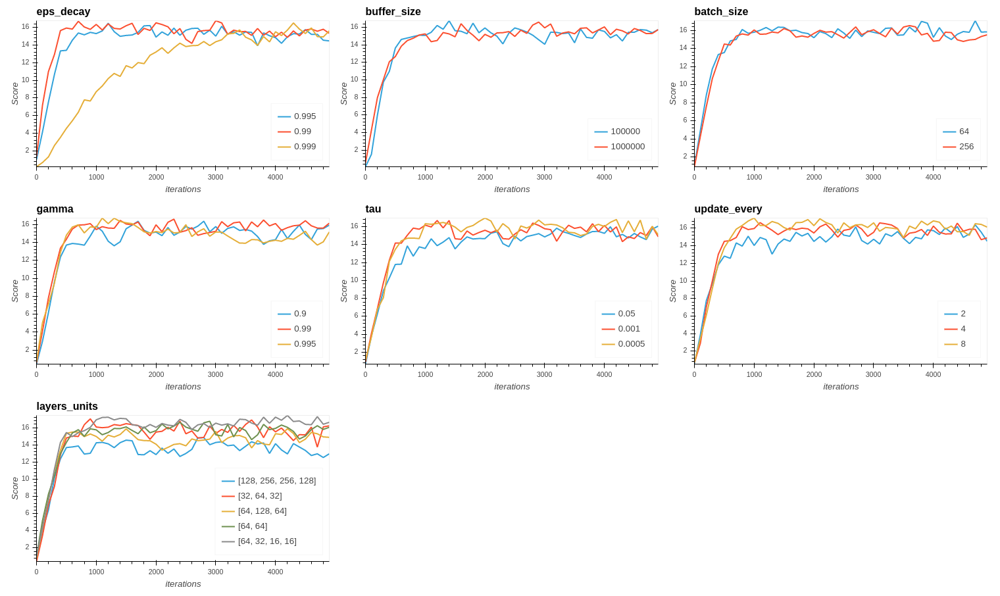

# Report Navigation

## Introduction

This project is part of the [Deep Reinforcerment Learning NanoDegree from Udacity](https://www.udacity.com/course/deep-reinforcement-learning-nanodegree--nd893) . The aim is to train an agent that navigates in a square world in order to collect as many yellow bananas as possible while avoiding blue bananas. 

The project environment is close to the Banana Collector environment from [Unity Machine Learning Agents Toolkit (ML-Agents Toolkit)](https://github.com/Unity-Technologies/ml-agents). It is an open-source project from Unity that offers various environments for training intelligent agents. It is designed to ease the training of agents by defining environments that offer observations, actions and rewards.

The state space of the Banana Collector environment has 37 dimensions and contains the agent's velocity, along with ray-based perception of objects around agent's forward direction.  Given this information, the agent has to learn how to best select actions.  Four discrete actions are available, corresponding to:
- **`0`** - move forward.
- **`1`** - move backward.
- **`2`** - turn left.
- **`3`** - turn right.

The banana collector task is episodic, and in order to solve the environment, our agent must get an average score of more than 13 over 100 consecutive episodes.

## Technical settings

As part of the Deep Reinforcement Learning course, this project reuses the source code offer by the course. Especially, it is derived from the following DQN implementation : [dqn/solution](https://github.com/udacity/deep-reinforcement-learning/tree/master/dqn/solution). The agent has been trained locally using PyTorch with Cuda involving an *Intel core i7 7700HQ*, *16Gb RAM* and a *Nvidia GP107* GPU.

## Solution

The Banana collector environment is solved using a Deep Q-Networks. This value based method approximates the action/values function that maximizes the reward (Q-table)  using a [Q Learning](https://link.springer.com/content/pdf/10.1007/BF00992698.pdf) reinforcement learning method. The current implementation includes includes two algorithmic contributions from the Deepmind paper [Human-level control through deep reinforcement learning](http://files.davidqiu.com//research/nature14236.pdf) that both help the convergence of the whole process. Convergence issues mainly arise with non linear approximators such as neural networks. These two approaches are :

- **Experience replay**: The Q-learning updates are performed on mini-batches of experiences (state, action, reward, next state).
- **Fixed Q Targets**: the idea is to adjust the action-value approximation at a given iteration rate. Parameters are held fixed between these individual updates.

## Parameterization

The Deep Q-Network algorithm alongside the experience replay and fixed Q Targets introduces many parameters we can play on to speed up the convergence and the final score of the trained agent :
- **eps_decay** : The coefficient applied on the *Epsilon* parameter after each epsiode ( balance exploration and exploitation in Epsilon-greedy action selection),
- **buffer_size** : The size of the replay buffer in the context of the *Experience replay*,
- **batch_size** : The size of the batch involved in the Q-learning update enhanced using *Experience replay*,
- **gamma** : The discount factor involved in the rewards expectation,
- **tau** : In the Q targets update from fixed Q target context, defines the weight given to the new parameters for the update.
- **update_every** : defines the update rate of the target from the Fixed Q Targets strategy,
- **layers_units** : The input of our neural network is an heterogeneous representation of the environment (ray based + velocities). Therefore, we kept a fully connected neural network. This parameter is a list that gives the number of neurons of each hidden layers.

Setting the right values for these parameters is not obvious. We propose the following approach to find a good distribution of hyper parameters : We start with the values from the DQN project that worked fine for the Lunar lander OpenAI Gym's LunarLander environment and that are close to the values proposed in the litterature:

- **eps_decay** : 0.995,
- **buffer_size** : 10000,
- **batch_size** : 64,
- **gamma** : 0.99,
- **tau** : 0.001.
- **update_every** : 4
- **layers_units** : [64, 64] : two fully connected hidden layers of 64 neurones each.

Since the training of the agent is time consuming, we chosed the following simple heuristic approach to find a good value for each hyper parameter. For each parameter, we introduce a list of values to test. Among those values, the one we keep is the one that leads to the best average score over the last 100 episodes after 5000 epsiodes of training.

More specificaly, we test the followings values :

- **eps_decay** : [0.99, 0.995, 0.999] (try a slower and a faster convergence to the exploitation over exploration)
- **buffer_size** : [100000, 1000000] (try to enlarge the buffer)
- **batch_size** : [64, 256] (see what happens with larger batch size)
- **gamma** : [0.9, 0.99, 0.995] (test lower and higher discount rates)
- **tau** : [0.05, 0.001, 0.0005] (test lower and higher importance for Q target update)
- **update_every** : [2, 4, 8] (lower and higher network parameters update rates)
- **layers_units** : [[64, 64], [64, 128, 64], [64, 32, 16, 16], [128, 256, 256, 128]] (test different neural network sizes)

When a value is "tested", we train a new agent for 5000 episodes with the adjusted parameter set to this value while the other parameters are set to the default values for the DQN project that solved OpenAI Gym's LunarLander.

Testing each parameter value for 5000 iterations gave us the following results. The following curves displays each 100 iterations the average score over the last 100 iterations:

Regarding the results, we choose to keep the following values :

- **eps_decay = 0.99** : this value induces a faster convergence and do not penalize the best value.
- **buffer_size = 100000** : changing the value does not seems to influence the results, we keep the default value.
- **batch_size** : changing the value does not seems to influence the results, we keep the default value.
- **gamma = 0.99** : this value proved to be the best
- **tau = 0.0005** : this value is slightly better than the other
- **update_every = 8** : this value is slightly better than the other
- **layers_units = [64, 32, 16, 16]** : this neural network structure is better than the others

## Results

Given our distribution of hyper-parameters, we get the following results :

{ width=70% }

Plotting every 100 iterations the average score over the 100 previous iterations induces a less noisy plot :

{ width=70% }

Our agent get an average score higher than 13 between the 500th and 600th iterations. Then it continues to improve until reaching a plateau around score 17 after 1000 iterations. The next iterations, between 1000 and 5000 are not necessary since our agent is not improving anymore.

## Perspectives

### Using a pixel based state representation

The state representation used in this project is convenient to implement. As discussed in the course, a more challenging task is to directly uses the pixels from the image of the agent navigating. This implies significant changes in the code :
- using a convolutional neural network such that the network would be able to extract relevant features from the image.
- using a multi-frames approach such as the stacking of the 4 last frames proposed in the [DeepMind paper](http://files.davidqiu.com//research/nature14236.pdf).

### Implements extension of DQN

As discussed in the course, a significant number of DQN extensions have been introduced in the litterature. DeepMind researchers evaluated the performance of an agent that implements six of the these approaches. This agent named rainbow outperformed the state of the art performance on Atari 2600 games. The environment we solved in this project would also benefit from these extensions.

### Refine hyper-parameters tuning

We proposed a naive approach to find our distribution of hyper parameters. The litterature is full of more structurated approaches to achieve such this task (Grid search, ). Some Python library propose high level frameworks (for instance Scikit Learn) for common approaches (Grid search, Random search, etc.).

